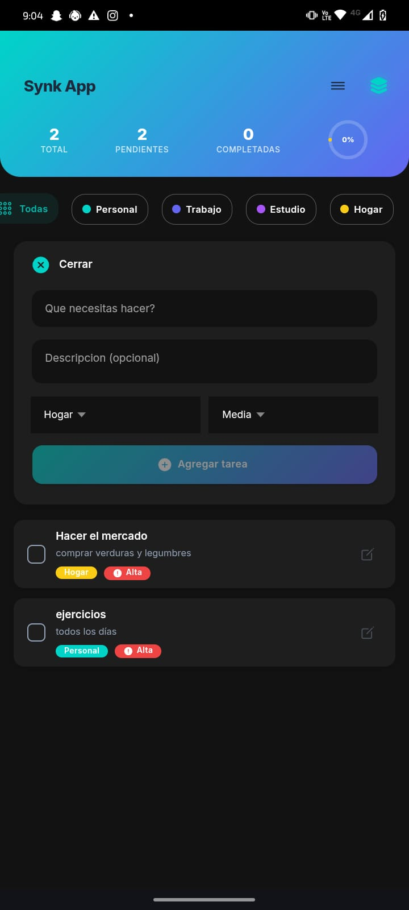
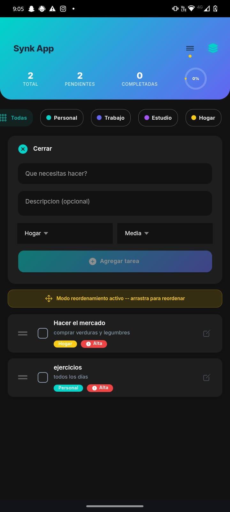
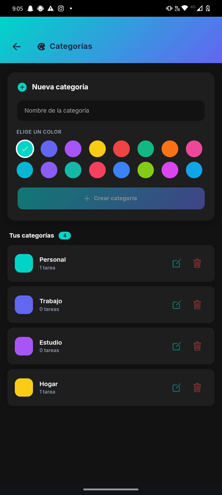

# Synk App - Todo en Sincronia

Aplicacion moderna de lista de tareas (To-Do List) desarrollada con **Ionic 8 + Angular 20**.

## 🚀 Entregables de la Prueba Técnica

- 📦 **APK Compilado:** [Descargar app-debug.apk desde Google Drive](https://drive.google.com/file/d/1ADnUqwaEuEwp5RPe-i0QdpRq0OuLy12h/view?usp=sharing).
- 🎥 **Video Demostrativo:** [Ver Video en Google Drive](https://drive.google.com/file/d/1j7_3Cx3O1odD03bR4mfFPqLCigXca_c-/view?usp=sharing).

### 📸 Capturas de Pantalla

*(Reemplaza las rutas de abajo por tus imágenes reales si decides subirlas al repo, o bórralas si envías las fotos adjuntas en el correo)*

<p align="center">
  
  &nbsp;&nbsp;&nbsp;
  
  &nbsp;&nbsp;&nbsp;
  
  <br/><br/>
  
  &nbsp;&nbsp;&nbsp;
  
</p>

---

## Caracteristicas

- **Gestion de Tareas:** Crear, completar (tachado), eliminar con swipe y reordenar con drag & drop
- **Gestion de Categorias:** Crear categorias con nombre y color, eliminar, conteo de tareas en tiempo real
- **Filtrado:** Filtrar tareas por categoria con chips interactivos
- **Firebase Remote Config:** Feature flag `show_priority_feature` para mostrar/ocultar campo de prioridad (Alta/Media/Baja)
- **Persistencia:** Almacenamiento local con localStorage
- **Optimizacion:** OnPush change detection, trackBy en listas, lazy loading, BehaviorSubject para estado reactivo

## Stack Tecnologico

| Tecnologia | Version |
|------------|---------|
| Angular | 20 |
| Ionic Framework | 8 |
| Capacitor | 8 |
| Firebase JS SDK | 11+ |
| TypeScript | 5.8 |

## Paleta de Colores

| Color | Hex | Uso |
|-------|-----|-----|
| Teal | `#00D4C8` | Primary |
| Indigo | `#6366F1` | Secondary |
| Purple | `#A855F7` | Tertiary |
| Yellow | `#FACC15` | Warning / Accent |
| Light BG | `#F3F4FF` | Fondo claro |
| Dark BG | `#0F172A` | Fondo oscuro |

## Requisitos Previos

- Node.js 18+ (LTS recomendado)
- npm 9+
- Ionic CLI: `npm install -g @ionic/cli`
- JDK 21 (para compilar Android)
- Android Studio (para generar APK)
- Xcode (para generar IPA, solo macOS)

## Instalacion

```bash
# Clonar el repositorio
git clone https://github.com/tu-usuario/Synk-App.git
cd Synk-App

# Instalar dependencias
npm install

# Instalar Firebase SDK
npm install firebase
```

## Ejecucion en Desarrollo

```bash
# Iniciar servidor de desarrollo
ionic serve
```

La app estara disponible en `http://localhost:8100`

## Configuracion de Firebase (Opcional)

1. Crea un proyecto en [Firebase Console](https://console.firebase.google.com)
2. Copia tu configuracion en `src/environments/environment.ts`
3. En Firebase Console, ve a **Remote Config** y crea el parametro:
   - Clave: `show_priority_feature`
   - Valor: `true` (para habilitar prioridad) o `false`
4. La app funciona al 100% sin Firebase - el campo de prioridad simplemente estara oculto

## Compilacion para Android

```bash
# 1. Compilar la app para produccion
ionic build --prod

# 2. Agregar plataforma Android
ionic cordova platform add android

# 3. Construir la app
ionic cordova build android
```

### Generar APK desde terminal

```bash
cd platforms/android
.\gradlew.bat assembleDebug

El APK se genera en: `platforms/android/app/build/outputs/apk/debug/app-debug.apk`

### Generar APK firmado (release)

En Android Studio: **Build > Generate Signed Bundle / APK > APK**

## Compilacion para iOS (requiere macOS)

```bash
# 1. Compilar
ionic build --prod

# 2. Agregar plataforma iOS
ionic cordova platform add ios

# 3. Construir
ionic cordova build ios

# 4. Abrir en Xcode
open platforms/ios/SynkApp.xcworkspace```

En Xcode: seleccionar dispositivo/simulador y presionar **Run** o archivar para generar IPA.

## Estructura del Proyecto

```
src/
  app/
    models/
      task.model.ts          # Interfaces Task, Category, Priority
    services/
      task.service.ts         # CRUD de tareas y categorias (localStorage)
      firebase.service.ts     # Firebase Remote Config
    home/
      home.page.ts            # Pagina principal de tareas
      home.page.html          # Template con lista, filtros, reorder
      home.page.scss          # Estilos de la pagina principal
      home.module.ts          # Modulo con lazy loading
    pages/
      categories/
        categories.page.ts    # Gestion de categorias
        categories.page.html  # Template de categorias
        categories.page.scss  # Estilos de categorias
        categories.module.ts  # Modulo con lazy loading
  environments/
    environment.ts            # Config de desarrollo + Firebase
    environment.prod.ts       # Config de produccion + Firebase
  theme/
    variables.scss            # Paleta de colores Synk
  global.scss                 # Estilos globales, fuente Inter
  index.html                  # HTML principal con SEO
```

## Arquitectura

- **NgModules** (no standalone) con lazy loading
- **OnPush Change Detection** en todos los componentes
- **BehaviorSubject** para estado reactivo en servicios
- **trackBy** en todas las directivas `*ngFor`
- **Firebase JS SDK** directo (sin AngularFire) para compatibilidad con Angular 20

### 1. ¿Cuáles fueron los principales desafíos que enfrentaste al implementar las nuevas funcionalidades?

El principal desafío fue mantener el estado sincronizado en tiempo real entre la gestión de tareas y el conteo de las categorías sin afectar el rendimiento. Al tener dos entidades relacionadas (Tareas y Categorías), fue crucial diseñar un servicio (`TaskService`) que utilizara `BehaviorSubject` para emitir el estado reactivo, asegurando que cuando una tarea se agrega, elimina o cambia de categoría, el contador en la vista de categorías se actualice instantáneamente en toda la aplicación sin necesidad de recargar la página. Además, asegurar la compatibilidad de Firebase Remote Config con Angular 20 requirió utilizar el SDK de Firebase en su versión más reciente y modular.

### 2. ¿Qué técnicas de optimización de rendimiento aplicaste y por qué?

Para asegurar una experiencia fluida y escalable, apliqué:
- **OnPush Change Detection:** Evita que Angular revise todo el árbol de componentes constantemente, renderizando solo cuando los `@Input()` cambian explícitamente.
- **trackBy en *ngFor:** Crucial para listas largas de tareas. Evita que el DOM se destruya y vuelva a crear al ordenar o modificar elementos.
- **Lazy Loading:** Los módulos de `home` y `categories` se cargan bajo demanda, minimizando el tiempo de carga inicial de la aplicación.
- **RxJS (BehaviorSubject):** Minimiza el uso de memoria al mantener una única fuente de verdad (Single Source of Truth) para el estado, evitando llamadas redundantes al `localStorage`.

### 3. ¿Cómo aseguraste la calidad y mantenibilidad del código?

Aseguré la mantenibilidad aplicando principios de **Clean Architecture** a nivel de frontend:
- **Separación de responsabilidades (SoC):** Los componentes (archivos `.ts`) no tienen lógica de negocio ni acceden directamente al `localStorage`. Toda esa responsabilidad se delegó a Servicios (`task.service.ts` y `firebase.service.ts`).
- **Tipado estricto:** Se crearon interfaces claras en `task.model.ts` para asegurar que las estructuras de datos (Task, Category) sean predecibles, aprovechando todo el potencial de TypeScript 5.
- **Modularidad:** El uso de variables SCSS globales en `theme/variables.scss` permite cambiar toda la paleta de colores de la aplicación desde un solo archivo, facilitando futuras iteraciones de diseño o temas oscuros.

## Licencia

MIT